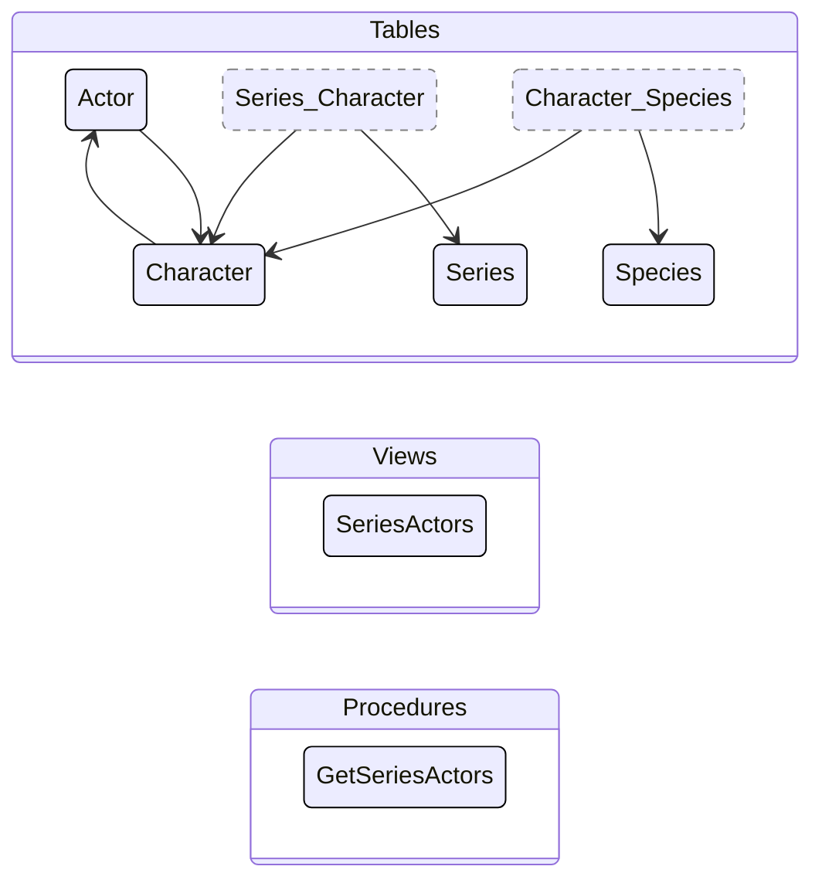

## dab-config.json

&nbsp;

### Tables
|Entity|Source|Relationships
|-|-|-
|Actor|dbo.Actor|Character
|Character|dbo.Character|Actor, Series, Species
|Series|dbo.Series|Character
|Species|dbo.Species|Character

### Views
|Entity|Source
|-|-
|SeriesActors|dbo.SeriesActors

### Stored Procedures
|Entity|Source
|-|-
|GetSeriesActors |dbo.GetSeriesActors

